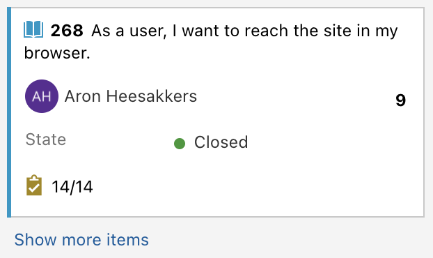

# Contributing

Currently this project is being developed by semester 6 software students of the FHICT. Because this project is larger than most and should end up in production, it is important that everything is well documented. Even though the project will be managed by PT groups, every bit of help is appreciated and everyone who is willing to help out is welcome.

## Conventions
- [Language](#Language)
- [Pull Request Policy](#PR-policy)
- [Contributors](#For-outside)
- [Members](#Members)

### <a name="Language">Language</a>
- English

Example
```cSharp
var completeButton = new CompleteButton();
```

### <a name="PR-Policy">Pull Request Policy</a>
#### Squash
Individual commits are automatically squashed on pull requests.

#### Auto merge
Waits for merge requirements to be met and then merges automatically.

#### Delete head branch
Merged pull requests will automatically delete head branches (are able to be restored).

### <a name="For-outside">For outside contributors</a>
#### Step 1
Choose an existing issue or 
create a new issue in one of the Fontys Internal Post repositories.

#### Step 2
Fork the repository.

#### Step 3
Create a new branch with a descriptive name.

#### Step 4
Commit your changes to the new branch.

#### Step 3
Create a pull request to the main repository and link the issue.

#### Step 4
Congratulations! You've submitted your changes. Wait for review and watch your code being merged to production!
🎉 🎉 🎉


### <a name="Members">For members</a>

The project is being developed with an Agile proces. We work in sprints of three weeks in which we deliver User Stories. These are decided in accordance with the Product Owner. The User Stories itself are written from the perspective of the user and mostly contain functionality in a vertical line from front- to backend. To manage this proces we use [Azure Boards](https://dev.azure.com/405273/IPost/)

Contact us to become a main member of the project.

#### Branch name
Each branch should be related to a user story of our sprint board.
The branch should be named according to the following format:
- `#{backlog-item-nr}-{short-title}`

##### Example


Branch name: `#53-finish-button`

### Commit Policy
- Commits must have describing titles. 

