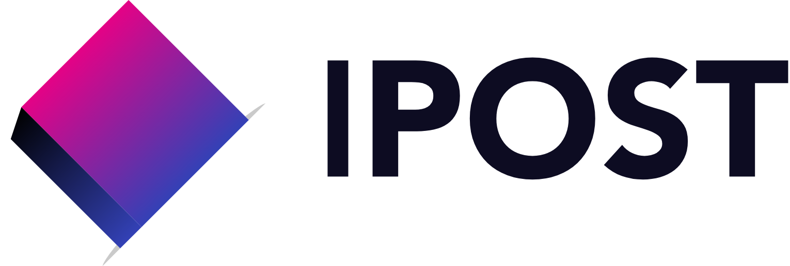

<h3 align="middle">
  <a href="https://github.com/FIPost/docs">Documentation</a>
  <a>•</a>
  <a href="https://github.com/FIPost/docs/blob/master/CONTRIBUTING.md">Contributing</a>
  <a>•</a>
  <a href="https://github.com/FIPost/docs/blob/master/CONTACT.md">Contact</a>
</h3>

# Fontys Internal Post
[](https://dev.azure.com/405273/a464a51f-a9d3-415a-983c-ecc9f9e1e117/_boards/board/t/e58d8192-5262-4682-856c-da357d004679/Microsoft.RequirementCategory)

This project aims to modernise the internal post system of Fontys. Currently most of the administrative work is done manually. This project moves these processes to a semi-automated system with similar functionalities as PostNL. Some of the features include: seeing a package status and tracing locations.

Keep in mind that this project is broader than just the FHICT. The software made will need to scale to manage the administrative post process of the entire Fontys organisation with over 4300 employees and 44.000 students.

This project is part of a long term pilot and is supposed to be developed over multiple semesters by different PT groups of software students. Transferability is therefore a must.
<br/><br/>
[DeX](https://dex.software/project/details/119-Fontys-Internal-Post)

## Collaboration

Currently this project is being developed by semester 6 software students of the FHICT. Because this project is larger than most and should end up in production, it is important that everything is well documented. Even though the project will be managed by PT groups, every bit of help is appreciated and everyone who is willing to help out is welcome.

Check [CONTRIBUTING](https://github.com/FIPost/docs/blob/master/CONTRIBUTING.md) for information.

## Code
This project is designed with a microservices architecture. This allows us to scale our software to support a large user base. To separate all concerns and keep the repositories SOLID each domain has been given each own codebase with its own repository.

Reason for this change is to encourage open source contributions.

### Repositories
- [ui](https://github.com/FIPost/ui)
- [track-and-trace-ui ](https://github.com/FIPost/track-and-trace-ui)
- [gateway](https://github.com/FIPost/api-gateway)
- [pakketservice](https://github.com/FIPost/pakketservice)
- [locatieservice](https://github.com/FIPost/locatieservice)
- [personeelservice](https://github.com/FIPost/personeel-service)
- [mailservice](https://github.com/FIPost/MailService)
- [docs](https://github.com/FIPost/docs)

#### Architectural Styles
- Architectural Styles
- Microservices
- Event Streaming
- Serverless

#### Languages & Frameworks used to build
**Back-End**
- Target Framework: NET50 (Only supported by VS16.10 and higher!!)
- Language: C#
- Build with: Visual studio 16.10

**Front-End**
- VueJS - TypeScript, JavaScript, SCSS, HTML

#### Deployment
- Docker
- MicroK8s
- Ubuntu 20.02 Linux

## Getting started
```zsh
# Zsh, Bash or Git Bash for Windows

mkdir ipost && cd ipost
git clone https://github.com/FIPost/docs.git
git clone https://github.com/FIPost/userservice.git
git clone https://github.com/FIPost/personeelsservice.git
git clone https://github.com/FIPost/locatieservice.git
git clone https://github.com/FIPost/pakketservice.git
git clone https://github.com/FIPost/ui.git
git clone https://github.com/FIPost/track-and-trace-ui.git
```

#### Ready?! 
Start contributing [<ins>now</ins>](https://github.com/FIPost/docs/blob/master/CONTRIBUTING.md) ! 

## Contact Us ✉️ 
Questions? [<ins>Contact us here </ins>](https://github.com/FIPost/docs/blob/master/CONTACT.md) !
